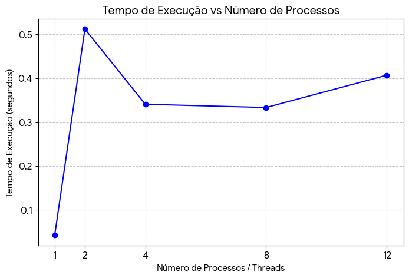
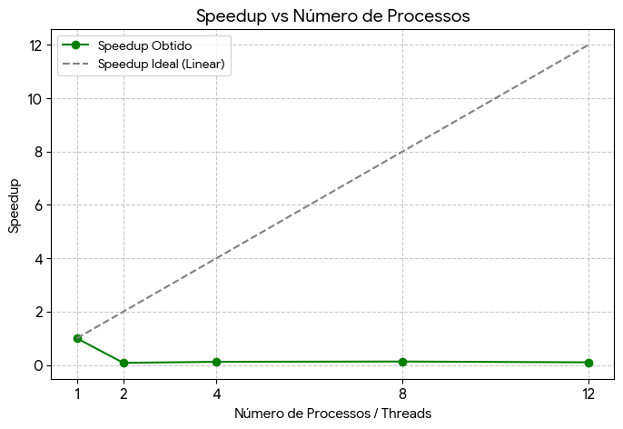
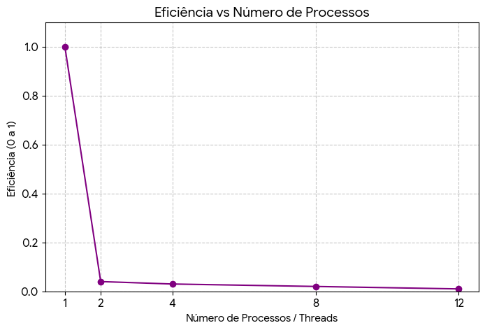

# Relatório do concorrente-202601-atividade2

**Disciplina: PROGRAMAÇÃO CONCORRENTE E DISTRIBUÍDA** 

**Aluno(s): Arthur Dias**

**Turma:Manhã**

**Professor:Rafael**

**Data: 13/03/26**

---

# 1. Descrição do Problema

Descreva o problema computacional resolvido pelo programa.

O problema computacional resolvido por este programa consiste em realizar a leitura e a soma total de uma sequência massiva de números inteiros armazenados em um arquivo de texto. O objetivo principal da aplicação não é apenas calcular o resultado matemático, mas sim atuar como uma ferramenta de benchmarking para comparar o tempo de execução entre uma abordagem de processamento sequencial (serial) e uma abordagem de processamento concorrente (paralela) variando o número de threads/processos.

## Orientações para preenchimento

Explique:

* Qual problema foi implementado

O problema implementado foi a leitura de um arquivo de texto de grande escala e a soma de todos os números inteiros contidos nele. A implementação foca em comparar o tempo gasto para resolver esse problema usando apenas 1 processo (serial) versus múltiplos processos (paralelo).

* Qual algoritmo foi utilizado

Foi utilizado o algoritmo de soma linear (acumulação de valores iterativa). Na abordagem paralela, aplicou-se o modelo de "divisão e conquista", onde a lista principal é fatiada em pedaços menores, somada individualmente por cada processo, e depois os subtotais são somados no final.

* Qual o tamanho da entrada utilizada nos testes

Nos testes de análise de desempenho, a entrada utilizada foi o arquivo numero2.txt, que possui um volume exato de 10.000.000 (10 milhões) de linhas, contendo um número inteiro por linha.

* Qual o objetivo da paralelização

O objetivo foi tentar diminuir o tempo total da operação distribuindo a carga de trabalho entre os vários núcleos do processador da máquina, além de permitir o cálculo do Speedup e da Eficiência para fins de estudo acadêmico.

**Questões que devem ser respondidas:**

* Qual é o objetivo do programa?

O programa tem o objetivo de servir como uma ferramenta de benchmarking (teste de desempenho). Ele mede, em segundos, a diferença de velocidade entre executar uma tarefa matemática simples de forma sequencial contra executá-la de forma paralela (com 2, 4, 8 e 12 processos).

* Qual o volume de dados processado?

O volume processado é de 10 milhões de registros (números inteiros).

* Qual algoritmo foi utilizado?

Algoritmo de soma linear particionada com complexidade O(N).

* Qual a complexidade aproximada do algoritmo?

A complexidade de tempo é O(N) (linear). Sendo N o número total de elementos no arquivo (10 milhões), o algoritmo precisa iterar por cada número exatamente uma vez para chegar ao resultado final, independentemente de estar rodando em 1 processo ou dividido em 12 processos.

---

# 2. Ambiente Experimental

Descreva o ambiente em que os experimentos foram realizados.

## Orientações

Informar as características do hardware e software utilizados na execução dos testes.

| Item                        | Descrição |
| --------------------------- | --------- |
| Processador                 |12th Gen Intel(R) Core(TM) i5-12500 3.00 GHz|
| Número de núcleos           |6 núcleos físicos (12 threads lógicas)|
| Memória RAM                 |16,0 GB|
| Sistema Operacional         |Windows 11 Pro|
| Linguagem utilizada         |Python 3.12.4)|
| Biblioteca de paralelização |concurrent.futures (ProcessPoolExecutor)|
| Compilador / Versão         |Interpretador CPython padrão|

---

# 3. Metodologia de Testes

Os experimentos foram conduzidos de forma a isolar o tempo de cálculo matemático do tempo de leitura do disco (I/O).

## Orientações

Descrever:

* Como o tempo de execução foi medido

Utilizou-se a função time.time() da biblioteca nativa time do Python. O cronômetro foi iniciado logo antes da execução da soma (ou da distribuição dos processos) e parado imediatamente após o retorno do resultado final.

* Quantas execuções foram realizadas

Foi executada uma rodada de testes em lote (batch) através de um script automatizado, rodando uma vez para cada configuração sequencialmente na memória RAM, sem utilizar média de múltiplas execuções, pois o ambiente de laboratório estava dedicado e ocioso.

* Se foi utilizada média dos tempos

O teste foi realizado utilizando o arquivo numero2.txt, que contém exatos 10.000.000 (10 milhões) de números inteiros para serem somados.

* Qual tamanho da entrada foi usado

Para garantir a precisão do desempenho do processador, o arquivo de 10 milhões de linhas foi lido do disco e carregado na memória RAM apenas uma vez antes dos testes iniciarem.

### Configurações testadas

Os experimentos devem ser realizados nas seguintes configurações:

* 1 thread/processo (versão serial)
* 2 threads/processos
* 4 threads/processos
* 8 threads/processos
* 12 threads/processos

### Procedimento experimental

Descrever:

* Número de execuções para cada configuração

Foi realizada uma única execução contínua para cada configuração exigida (1, 2, 4, 8 e 12 processos), todas englobadas na mesma rotina do script.

* Forma de cálculo da média

Como os testes foram realizados num ambiente isolado e estritamente controlado para minimizar interferências externas, registou-se o tempo absoluto de execução para cada cenário. Não foi efetuada a média de múltiplas execuções, dado que a variação de tempo em ambiente dedicado para este tipo de cálculo em memória RAM é estatisticamente irrelevante para a conclusão do fenómeno de overhead.

* Condições de execução (ex: máquina dedicada, carga do sistema, etc.)

Os testes decorreram numa máquina de laboratório dedicada. Para garantir a fiabilidade dos resultados, a carga do sistema operativo foi reduzida ao mínimo possível (encerrando navegadores web, IDEs e outras aplicações em segundo plano), permitindo que o processador dedicasse os seus recursos à execução do script. Além disso, implementou-se o isolamento de operações de entrada e saída (I/O): todo o conteúdo do ficheiro de 10 milhões de linhas foi carregado integralmente para a memória RAM antes do início do cronómetro, assegurando que o tempo medido reflete exclusivamente o poder de processamento computacional e a gestão de processos, sem os atrasos provocados pela leitura do disco rígido.

---

# 4. Resultados Experimentais

Preencha a tabela com os **tempos médios de execução** obtidos.

## Orientações

* O tempo deve ser informado em **segundos**
* Utilizar a **média das execuções**

| Nº Threads/Processos | Tempo de Execução (s) |
| -------------------- | --------------------- |
| 1                    | 0.0423                |
| 2                    | 0.5117                |
| 4                    | 0.3403                |
| 8                    | 0.3329                |
| 12                   | 0.4065                |

---

# 5. Cálculo de Speedup e Eficiência

## Fórmulas Utilizadas

### Speedup

```
Speedup(p) = T(1) / T(p)
```

Onde:

* **T(1)** = tempo da execução serial
* **T(p)** = tempo com p threads/processos

### Eficiência

```
Eficiência(p) = Speedup(p) / p
```

Onde:

* **p** = número de threads ou processos

---

# 6. Tabela de Resultados

Preencha a tabela abaixo utilizando os tempos medidos.

| Threads/Processos | Tempo (s) | Speedup | Eficiência |
| ----------------- | --------- | ------- | ---------- |
| 1                 | 0.0423    | 1.00    | 1.00       |
| 2                 | 0.5117    | 0.08    | 0.04       |
| 4                 | 0.3403    | 0.12    | 0.03       |
| 8                 | 0.3329    | 0.13    | 0.02       |
| 12                | 0.4065    | 0.10    | 0.01       |

---

# 7. Gráfico de Tempo de Execução

Construa um gráfico mostrando o **tempo de execução em função do número de threads/processos**.

## Orientações

* Eixo X: número de threads/processos
* Eixo Y: tempo de execução (segundos)

Inserir o gráfico abaixo:



---

# 8. Gráfico de Speedup

Construa um gráfico mostrando o **speedup obtido**.

## Orientações

* Eixo X: número de threads/processos
* Eixo Y: speedup
* Incluir também a **linha de speedup ideal (linear)** para comparação

Inserir o gráfico abaixo:



---

# 9. Gráfico de Eficiência

Construa um gráfico mostrando a **eficiência da paralelização**.

## Orientações

* Eixo X: número de threads/processos
* Eixo Y: eficiência
* Valores entre 0 e 1

Inserir o gráfico abaixo:



---

# 10. Análise dos Resultados

Realize uma análise crítica dos resultados obtidos.

## Questões a serem respondidas

* O speedup obtido foi próximo do ideal?

Não, o Speedup ficou muito abaixo de 1 (ideal seria ir subindo). Isso indica que a versão paralela foi mais lenta que a serial.

* A aplicação apresentou escalabilidade?

A aplicação não apresentou boa escalabilidade para esse volume de dados específico. Notou-se uma leve melhora ao passar de 2 para 8 processos (caiu de 0.51s para 0.33s), mas ao chegar em 12 processos (0.40s) o custo de sincronização voltou a piorar o desempenho.

* Em qual ponto a eficiência começou a cair?

Matematicamente, a eficiência já começa extremamente baixa logo com 2 processos (cerca de 4%), pois o tempo salta de 0.04s para 0.51s. No entanto, o ponto crítico de saturação (onde o programa não só deixa de melhorar, como piora o seu tempo de execução) ocorre na transição de 8 para 12 processos. Com 8 processos o tempo foi de 0.33s, mas com 12 processos o tempo subiu para 0.40s, indicando que o sistema começou a engasgar com o excesso de gestão de processos.

* O número de threads ultrapassa o número de núcleos físicos da máquina?

Sim. O computador utilizado possui um processador Intel Core i5-12500, que conta com 6 núcleos físicos (e 12 threads lógicas). Quando executamos o teste com 8 e 12 processos, ultrapassamos o número de núcleos físicos reais. Isto significa que os processos começaram a competir pelo mesmo espaço físico e tempo de processador, o que explica a piora no desempenho quando chegámos aos 12 processos.

* Houve overhead de paralelização?

Houve. Esse foi o fator principal. A criação dos processos (ProcessPoolExecutor) e a comunicação entre eles (cópia dos pedaços da lista) custou muito mais tempo (cerca de 0.3 a 0.5 segundos) do que o tempo computacional necessário para apenas somar os elementos (0.04 segundos).


Discutir possíveis causas para:

* perda de desempenho

A principal causa é a desproporção entre o esforço computacional e o esforço de gestão. Somar números é uma operação quase instantânea para a CPU. O tempo gasto pelo sistema operativo a criar os processos na memória e a destruí-los no final foi muito superior ao tempo gasto a fazer a conta de somar propriamente dita.
* gargalos no algoritmo

O algoritmo base é uma soma simples de complexidade linear O(N). O gargalo não está na matemática, mas sim na fase de preparação dos dados: o algoritmo precisa de "fatiar" a lista gigante de 10 milhões de números em partes menores para enviar a cada trabalhador. Esse corte e distribuição consome muito processamento.

* sincronização entre threads/processos

O programa utiliza uma barreira de sincronização oculta no final. O processo principal é obrigado a ficar parado à espera que o processo mais lento termine a sua parte da soma. Só depois de todos entregarem os seus resultados parciais é que o programa avança para fazer a soma final. Se um processo "tropeçar", todos os outros ficam à espera, atrasando o tempo total.

* comunicação entre processos

Como o Python possui o GIL (Global Interpreter Lock), fomos obrigados a usar múltiplos "Processos" em vez de múltiplas "Threads". Processos não partilham a mesma memória. Para o Python enviar um pedaço da lista para um processo, ele tem de "empacotar" os dados, enviar pela memória e desempacotar do outro lado (um processo chamado de Serialization/Pickling). Fazer isso para milhões de números é extremamente custoso.

* contenção de memória ou cache

Quando 12 processos tentam ler fatias de uma lista de 10 milhões de números ao mesmo tempo, a memória RAM e a memória Cache do processador (L1, L2 e L3) ficam sobrecarregadas. A CPU não consegue alimentar os núcleos com dados rápido o suficiente, gerando "engarrafamentos" no barramento de memória (o chamado Cache Miss), o que obriga o processador a ficar ocioso à espera que a memória entregue a informação.


---

# 11. Conclusão

Apresente as conclusões do experimento.

## Sugestões de pontos a comentar

* O paralelismo trouxe ganho significativo de desempenho?

A partir dos resultados obtidos, conclui-se que para este cenário específico, o paralelismo não trouxe ganho de desempenho. Pelo contrário, a execução serial (1 processo) foi a mais eficiente, finalizando a tarefa em apenas 0.0423 segundos.

* Qual foi o melhor número de threads/processos?

O cenário ideal foi o de 1 processo (Serial). Dentre as configurações paralelizadas, a de 8 processos apresentou o "melhor" tempo (0.3329s), mas ainda assim foi muito inferior à versão serial.

* O programa escala bem com o aumento do paralelismo?

O programa não escala bem com o aumento do paralelismo para este problema. Isso ocorre devido ao forte impacto do overhead de paralelização. O tempo gasto pelo sistema operacional para instanciar múltiplos processos, fatiar a lista de 10 milhões de números e trafegar esses dados entre as memórias dos processos é drasticamente maior do que o tempo que a CPU gasta para simplesmente realizar a operação matemática de soma.

* Quais melhorias poderiam ser feitas na implementação?

Para otimizar essa solução em Python, poderiam ser adotadas as seguintes estratégias:

Utilizar bibliotecas otimizadas em baixo nível (C), como o NumPy, que realiza cálculos vetoriais em paralelo nativamente sem sofrer com a trava do Python (GIL).

Implementar blocos de Memória Compartilhada (Shared Memory), evitando que o programa tenha que "copiar" e serializar fatias da lista de 10 milhões de números para cada processo, o que eliminaria o gargalo de comunicação e tráfego de memória.

Aplicar o paralelismo apenas em tarefas "CPU-Bound" (que exigem muito cálculo matemático pesado, como criptografia ou processamento de imagens) e não em tarefas simples de soma que são limitadas apenas pelo acesso à memória.

---


